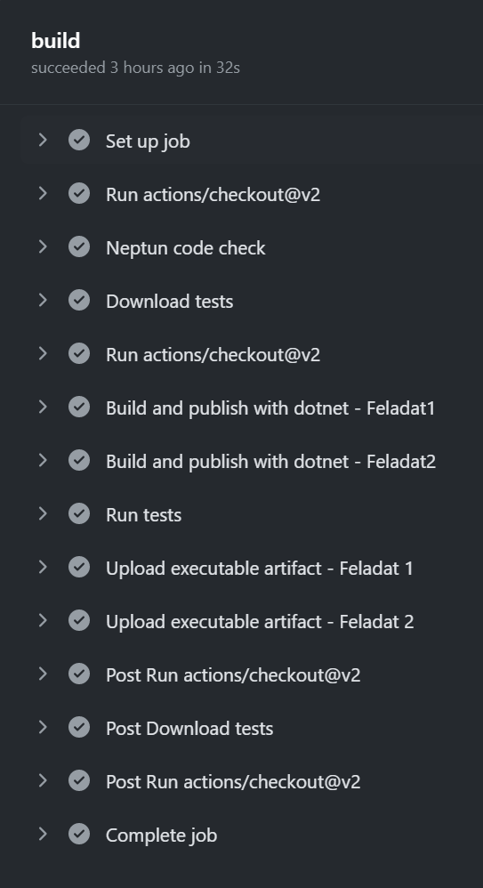

# 1. HF - A modell és a kód kapcsolata

## Bevezetés

A feladathoz nem kapcsolódik előadás.  A feladatok elméleti és gyakorlati hátteréül az  „1. A modell és a kód kapcsolata” vezetett laborgyakorlat szolgál:

- Ezt a laborgyakorlatot a hallgatók a gyakorlatvezető útmutatásával, a gyakorlatvezetővel közösen vezetett módon végzik/végezték el.
- A laborgyakorlathoz útmutató tartozik, mely részletekbe menően bemutatja az elméleti hátteret, valamint lépésenként ismerteti a megoldás elkészítését: [1. A modell és a kód kapcsolata](../../labor/1-model-es-kod-kapcsolata/index.md)

Erre építve jelen önálló gyakorlat feladatai a feladatleírást követő rövidebb iránymutatás segítségével elvégezhetők.

Az önálló gyakorlat célja:

- Egy egyszerű .NET alkalmazás elkészítése, C# alapok gyakorlása
- Az UML és a kód kapcsolatának szemléltetése
- Az interfész és az absztrakt ősosztály alkalmazástechnikájának gyakorlása

A szükséges fejlesztőkörnyezetről [itt](../fejlesztokornyezet/index.md) található leírás.

## A kiindulási környezet letöltése, az elkészült megoldás feltöltése

A házi feladat kiindulási környezetének publikálása, valamint a megoldás beadása Git, GitHub és GitHub Classroom segítségével történik. GitHub Classroom segítségével hozz létre magadnak egy repository-t. A meghívó URL-t a tárgy AUT honlapján találod. Klónozd le az így elkészült repository-t. Ez tartalmazni fogja a megoldás elvárt szerkezetét. A feladatok elkészítése után commit-old és push-old a megoldásod. Ezekhez itt található részletesebb leírás:

- [Git, GitHub, GitHub Classroom](../git-github-github-classroom/index.md)
- [A kiinduló alkalmazáskeret letöltésének és a feladat beadásának lépései](../hf-folyamat/index.md)
- Napi Git munka Visual Studio segítségével (Commit, Push)

## A házi feladat előellenőrzése

### A házi feladat előellenőrzése és hivatalos értékelése

- Minden egyes alkalommal, miután a GitHub-ra push-oltál kódot, a GitHub-on automatikusan lefut a feltöltött kód (elő)ellenőrzése, és meg lehet nézni a kimenetét! Az ellenőrzőt maga a GitHub futtatja. A pusht követően a feladat egy várakozási sorba kerül, majd adott idő után lefutnak az ellenőrző tesztek. Azt nem lehet tudni, mennyi ez az idő, a GitHub-on múlik. Amikor csak egy-két feladat van a sorban a szervezetre (ez nálunk a tárgy), akkor a tapasztalatok alapján az ellenőrzés 1-2 percen belül elindul. De ha a tárgy alatt egyszerre sokan kezdik majd feltölteni a megoldást, akkor ez jó eséllyel belassul. Nem érdemes ezért sem az utolsó pillanatra hagyni a beadást: lehet, hogy ekkor a késleltetések miatt már nem kapsz esetleg időben visszajelzést.
- :exclamation: **Hivatalosan a feladat azon állapota kerül értékelésre, amely a határidő lejártakor GitHub-on fent van.** A hivatalos ellenőrzést szokásos módon, saját, oktatói környezetben végezzük és az eredményt a tárgy honlapján publikáljuk a számonkérésnél. Vagyis a hivatalos eredmény tekintetében teljesen mindegy, hogy a GitHub-on a határidő lejárta lefutott-e már bármiféle (elő)ellenőrzés, vagy hogy az ellenőrzés estleg csak később tudott elindulni. A GitHub általi ellenőrzés csak azt a célt szolgálja, hogy még a határidő lejárta előtt visszajelzést kaphasson mindenki. A hivatalos ellenőrzés tartalmaz még plusz lépéseket a GitHub alapú előellenőrzéshez lépest, az előellenőrzés ilyen értelemben részleges, de azért sok problémát segíthet megfogni! 
- :exclamation: **Arra kérünk, hogy ne apránként push-olj, csak a kész, átnézett, forduló megoldást tedd fel!** Ez nem a legszerencsésebb, de a GitHub korlátozott időt biztosít az ellenőrzők futtatására:   ha elfogy a havi keret, akkor már nem fogtok visszajelzést kapni, csak a határidő utáni hivatalos ellenőrzés kimenetét kapja meg mindenki.
- A (fél)automata ellenőrző, most még egy részben kísérleti projekt. Ha valaki az útmutatóban inkonzisztenciát talál, vagy az ellenőrző adott helyzetet nem kezel és indokolatlanul panaszkodik, Benedek Zoltán felé legyen szíves jelezni! Ugyanakkor ezeket nagy tömegben nem fogjuk tudni kezelni. Ha jó a megoldásod, és az ellenőrző indokolatlanul panaszkodik, a hivatalos ellenőrzés során természetesen el fogjuk fogadni.
- Az előellenőrző – különösen az első házi feladat esetében – sokszor eléggé „gépközeli megfogalmazásban” jelzi az esetleges problémákat. Ha semmiképpen nem tudod értelmezni, írj Benedek Zoltánnak Teams-ben, a hibaüzenet megadásával, **illetve egy linkkel a repository-dra**.

### A GitHub által futtatott ellenőrzések megtekintése

1. GitHub-on a navigálás a repository-hoz
2. *Actions* tabfülre váltás
3. Itt megjelenik egy táblázat, minden push által futtatott ellenőrzéshez egy külön sor, a tetején van legfrissebb. A sor elején levő ikon jelzi a státuszt: vár, fut, sikeres, sikertelen lehet. A sor szövege a Git commit neve.
4. Egy sorban a commit nevén kattintva jelenik meg egy átfogó oldal az ellenőrző futásáról, ez sok információt nem tartalmaz. Ezen az oldalon baloldalt kell a „build” vagy „build-and-check” (vagy hasonló nevű) linken  kattintani, ez átnavigál az ellenőrzés részletes nézetére. Ez egy „élő” nézet, ha fut a teszt, folyamatosan frissül. Ha végzett, a csomópontokat lenyitva lehet megnézni az adott lépés kimenetét.  Ha minden sikerült, egy ehhez hasonló nézet látható:

    

5. Itt a legfontosabb talán a „Run tests” lépés.
Ha valamelyik lépés sikertelen, pipa helyett piros x van a csomópont elején, és a csomópontot kibontva a teszt kimenete utal a hiba okára. A „Error Message”-re, ill. az „Assert”-re érdemes szövegesen keresni a kimentben, ennek a környékén szokott lenni hivatkozás a hiba okára.