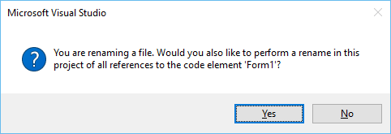
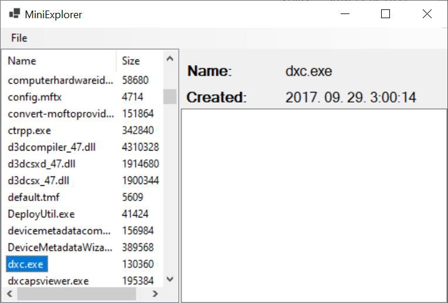
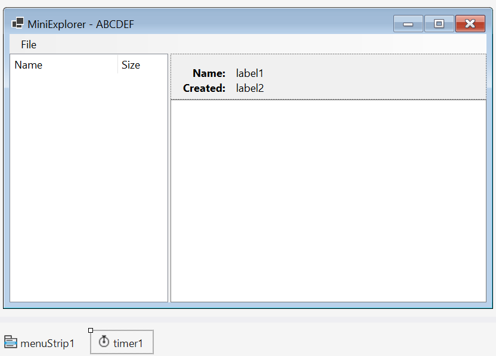
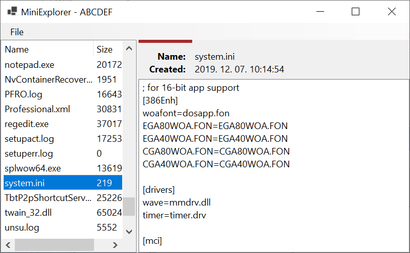

# 3. HF - Felhasználói felület kialakítása

## Bevezetés

Az önálló feladat a 3-5. előadásokon elhangzottakra épít. A feladatok gyakorlati hátteréül a [3. gyakorlat – Felhasználói felületek kialakítása](../../labor/3-felhasznaloi-felulet/index.md) laborgyakorlat szolgál.

A fentiekre építve, jelen önálló gyakorlat feladatai a feladatleírást követő rövidebb iránymutatás segítségével elvégezhetők.

Az önálló gyakorlat célja:

- Windows Forms tervező használatának gyakorlása
- Alapvető vezérlők (gomb, szövegdoboz, menük, listák) használatának gyakorlása
- Eseményvezérelt programozás gyakorlása
- Grafikus megjelenítés gyakorlása Windows Forms technológiával

Szükséges fejlesztőeszköz: Visual Studio 2022.

A feladat publikálásának, elkészítésének alapelvei és követelményei:

- A feladathoz tartozó GitHub Classroom hivatkozás: **TODO**
  A munkamenet megegyezik az előző házi feladatéval: a fenti hivatkozással mindenkinek születik egy privát repója, abban kell dolgozni és a határidőig a feladatot beadni.
- A kiklónozott fájlok között több csproj fájl is található. Ne ezeket nyisd meg, hanem a `WinFormExpl.sln`-t és ebben dolgozz!
- Az egyes feladatok leírásánál ==Külön megjelöltük== azokat az azonosítókat, szövegeket, melyeknél fontos, hogy a beadott feladatban a megadott érték szerepeljen
- A feladatok kérik, hogy készíts **képernyőképet** a megoldás egy-egy részéről, mert ezzel bizonyítod, hogy a megoldásod saját magad készítetted. **A képernyőképek elvárt tartalmát a feladat minden esetben pontosan megnevezi.**
A képernyőképeket a megoldás részeként kell beadni, a repository-d gyökérmappájába tedd (a Neptun.txt mellé). A képernyőképek így felkerülnek GitHub-ra git repository tartalmával együtt. Mivel a repository privát, azt az oktatókon kívül más nem látja. Amennyiben olyan tartalom kerül a képernyőképre, amit nem szeretnél feltölteni, kitakarhatod a képről.
- A beadott megoldások mellé külön indoklást, illetve leírást nem várunk el, ugyanakkor az elfogadás feltétele, hogy a beadott kódban a feladat megoldása szempontjából relevánsabb részek kommentekkel legyenek ellátva.
- Ha valakinél az előellenőrző csak az opcionális feladatok esetében jelez hibát, az nem jelent problémát az alapfeladatok vonatkozásában.

A következők is fontosak, ugyanazok, mint az 1. házi feladat esetében voltak:

1. A kiinduló projektben van egy `.github/workflows` mappa, ennek tartalmát tilos megváltoztatni, törölni, stb.
2. A munka során a kiindulási repóban levő solutionben/projektben kell dolgozni: új solution és/vagy projektfájl létrehozása, vagy a projekt más/újabb .NET verziókra targetelése tilos.
3. A repository gyökérmappájában található neptun.txt fájlba írd bele a Neptun kódod, csupa nagybetűvel. A fájlban csak ez a hat karakter legyen, semmi más.
4. Oldd meg a feladatot. Pushold a határidőig. Akárhány commitod lehet, a legutolsó állapotot fogjuk nézni.
5. A megoldást a tanszéki portálra nem kell feltölteni, de az eredményt itt fogjuk meghirdetni a kapcsolódó számonkérés alatt.
6. A házi feladatot külön explicit beadni nem kell, csak legyen fent GitHub-on határidőre a megoldás.
7. Amikor a házi feladatod beadottnak tekinted, célszerű ellenőrizni a GitHub webes felületén a repository-ban a fájlokra való rápillantással, hogy valóban minden változtatást push-oltál-e.
8. Szokásosan az előellenőrző pozitív kimenetele nem jelenti a feladat automatikus elfogadását, a végső oktatói ellenőrzés plusz szempontokat is figyelembe vesz.

## Ellenőrző futtatása

Jelen házi feladathoz kapcsolódó tesztek futtatása időigényes. Sajnos a GitHub limitek nem teszik lehetővé, hogy a szokásos módon automatizáltan GitHub alapokon futtassuk. A tesztek futtatására mindenkinek a saját számítógépén van mód a következőknek megfelelően.

### Telepítendő eszközök 

==TODO ezt a rész revidiálni kell!==

### Futtatás

## Feladat 1- Menü

### Bevezető feladat

??? tip "Ha nem nyílna meg a Form Designer."
    A Visual Studio 2022 a Git-ből frissen kiklónozott forrás esetén (amikor még nem létezik egy .csproj.user kiterjesztésű fájl) az űrlapokat - valószínűsíthetően egy bug miatt – nem hajlandó megnyitni szerkesztő módban. A solution megnyitása után jó eséllyel ezt látjuk a Solution Explorerben:

    

    A probléma az, hogy a Form1.cs előtti ikon (pirossal bekeretezve) nem egy űrlap, hanem egy zöld C# ikon. Ez esetben hiába kattintunk duplán a fájlon, nem az űrlap szerkesztő nyílik meg, hanem csak a forrásfájl. A megoldás ez esetben a következő: a *Build* menüben válasszuk ki a *Rebuild soultion* parancsot, majd a *Build* menüben a *Clean solution* parancsot, és várjunk egy kicsit. Ekkor pár másodperc múlva a Solution Explorerben az űrlapunk ikonja megváltozik:

    

    Most már meg tudjuk nyitni az űrlapot szerkesztésre, ha duplán kattintunk a Solution Explorerben a fenti csomóponton.

    Ha valakinél ez nem működne, akkor a tárgy Teams csoportjában a *Házi feladat konzultáció* csatornára váltva a Fájlok tabfül alatti `WinFormExpl.csproj.user` fájlt másold be a `WinFormExpl.csproj` mellé és utána nyisd meg a solutiont.

A főablak fejléce a "==MiniExplorer==" szöveg legyen, hozzáfűzve a saját Neptun kódod: (pl. "ABCDEF" Neptun kód esetén "MiniExplorer - ABCDEF”), fontos, hogy ez legyen a szöveg! Ehhez az űrlapunk `Text` tulajdonságát állítsuk be erre a szövegre.

Az űrlapunk neve jelenleg "Form1", ami szintén elég semmitmondó. Nevezzük át Neptun kódunknak megfelelően (pl. "ABCDEF" Neptun kód esetén "MainForm_ABCDEF”-re.

Az átnevezést a Solution Explorerben tudjuk megtenni, itt több technikát is használhatunk. Válasszuk ki a `Form1` elemet, majd még egyszer kattintsunk rajta bal gombbal: ekkor a név szerkeszthetővé válik (pont úgy dolgozunk, ahogy egy fájlt is átnevezünk Windows Explorerben). Vagy egyszerűen csak megnyomjuk az ++F2++ billentyűt az átnevezés elindításához. Vagy akár használhatjuk a jobb gombos menü *Rename* funkcióját. Akárhogy is indultunk, írjuk be új névnek a `MainForm.cs`-t, majd nyomjuk meg az Enter billentyűt. Ekkor a Visual Studio rákérdez egy felugró ablakban, hogy minden kapcsolódó elemet nevezzen-e át ennek megfelelően: itt mindenképpen **Yes**-t válasszunk:



!!! tip "Ha hiba van"
    Ha netán ekkor valami furcsa hibával mutatja a Visual Studio az űrlapunkat, akkor zárjuk be az űrlap tabfülét (vagy az összes tabfület), majd nyissuk meg újra, a hiba ekkor várhatóan megszűnik.

### Feladat

Vezessünk be egy menüsort a főablakunk (`Form1`) tetején. A menüben egyetlen elem legyen "File” néven, két almenüvel:

- ==Open==: később adunk neki funkciót
- ==Exit==: kilép az alkalmazásból

!!! danger "Elnevezések"
    Lényeges, hogy a menük szövegei a fent megadottak legyenek!

### Megoldás

1. Húzzunk be a felületre egy `MenuStrip` vezérlőt
2. A `MenuStrip` vezérlő bal szélén megjelenő szövegdobozba írjuk be, hogy "File”, ezzel létrehoztuk a főmenüt
3. Az újonnan létrehozott főmenüt kijelölve hozzuk létre a két almenüt.
4. Egyesével kijelölgetve a menüelemeket, töltsük ki a nevüket (`miOpen`, `miExit`).

    !!! Warning "Csak a `Name`-et állítsd!"
        A vezérlőknek csak a `Name` tulajdonságát állítsd, az `AccessibleName`-t ne. Ez a későbbi feladatokra is vonatkozik.

5. Valósítsuk meg a kilépés funkciót a kapcsolódó gyakorlathoz hasonlóan.

## Feladat 2 – Dialógusablak

A Windows Forms világban gyakran fordul elő, hogy egyedi vezérlőket, vagy ablak típusokat akarunk definiálni, továbbá ezek és a programunk többi része között információkat akarunk átadni. A következő feladat erre mutat példát.

### Feladat

Készíts egy új ablak (`Form`) típust ==InputDialog== néven (a fejléce is legyen ==InputDialog==), mely egy szövegdobozt (`TextBox`), továbbá egy ==Ok== és egy ==Cancel== feliratú gombot tartalmaz. A két gomb bezáráskor állítsa be a `Form` `DialogResult` tulajdonságát `DialogResult.OK`, illetve `DialogResult.Cancel` értékre. Az ablak ezen felül tartalmazzon egy publikus, `string` típusú, `Path` nevű tulajdonságot!

Az ablak tartalma arányosan változzon az átméretezés során:

- `TextBox` szélessége növekedjen (a helye ne változzon),
- A gombok a hozzájuk közelebbi sarokhoz képest rögzített pozícióban maradjanak (mind x mind y koordináta tekintetében, az ablak szélességének és magasságának állításakor is). Az *Ok* gomb legyen bal, a *Cancel* pedig jobb oldalon.

### Megoldás

A feladatot próbáld meg önállóan megoldani, majd a lenti leírás alapján ellenőrizd a megoldásod!

??? success "Megoldás"

    1. Adjunk hozzá a projektünkhöz egy új ablak típust (projekten jobb klikk, majd *Add / Form (Windows Forms)*, a neve legyen InputDialog.

    2. Adjunk az ablakhoz egy `TextBox`, egy `Label` és két `Button` vezérlőt. Rendezzük el őket a felületen és állítsuk be a tulajdonságaikat:
        - `TextBox`
            - `Name`: `tPath`
        - `Button`
            - `Name`: `bOk`
            - `Text`: "Ok"
            - `DialogResult`: `OK`
        - `Button`
            - `Name`: `bCancel`
            - `Text`: "Cancel"
            - `DialogResult`: `Cancel`
        - `Label`
            - `Text`: "Path"
        - `InputDialog` (maga a `Form`)
            - `AcceptButton`: `bOk`
            - `CancelButton`: `bCancel`

        A dialógusablak elkészítésekor kihasználjuk azt, hogy egy modális dialógusablakot nem csak a `Close` utasítással lehet bezárni, hanem úgy is, ha értéket adunk a `DialogResult` tulajdonságának. Ezt kódból is megtehettük volna, de mi most a gombok erre szolgáló mechanizmusát használtuk a `Form` `Accept` és `Cancel` button tulajdonságaival.

    3. Az egyes vezérlők `Anchor` tulajdonságainak beállításaival érjük el, hogy az ablak tartalma arányosan változzon az átméretezés során: a `TextBox` szélessége növekedjen, a gombok pedig a hozzájuk közelebbi sarokhoz képest rögzített pozícióban maradjanak (mind x mind y koordináta tekintetében, az ablak szélességének és magasságának állításakor is)

    4. Vegyünk fel egy `Path` nevű tulajdonságot az `InputDialog.cs` fájlba, mely a `TextBox` tartalmát teszi elérhetővé az osztályon kívülről is. (A tervezői nézet és a forrásnézet között az ++F7++ billentyűvel válthatunk)

        ```csharp
        public string Path
        {
            get { return tPath.Text; }
            set { tPath.Text = value; }
        }
        ```

    5. Kössük be a dialógusablakot a főablakba! Ehhez kattintsunk duplán a *Open* menüelemre és írjuk meg a dialógusablak megnyitásának kódját.

        ```csharp
        private void miOpen_Click(object sender, EventArgs e)
        {
            var dlg = new InputDialog();
            if (dlg.ShowDialog() == DialogResult.OK)
            {
                string result = dlg.Path;
                MessageBox.Show(result);
                // TODO: további lépések...
            }
        }
        ```
    
        !!! tip "Elnevezések"
            A WinForms világban rendkívül gyakori, hogy egy adott információ különböző szintű elérésért egy vezérlő és egy tulajdonság is felel (mint esetünkben a `tPath` szövegdoboz és a Path tulajdonság). A vezérlők neveinek prefixálásával (amit itt is alkalmaztunk) elkerülhetjük a nem kívánt névütközéseket.

        !!! danger "Fontos"
            A `MessageBox.Show(result);` sort kommentezzük is ki, a későbbiekben zavaró lenne.

!!! example "BEADANDÓ"
    Mielőbb továbbmennél a következő feladatra, egy képernyőmentést kell készítened `Feladat2.png` néven, ennek módját az alábbi.

    - Indítsd el az alkalmazást. Ha szükséges, méretezd át kisebbre, hogy ne foglaljon sok helyet a képernyőn,
    - a „háttérben” a Visual Studio legyen, a `MainForm_<neptun>.cs` megnyitva,
    - a VS *View / Full Screen* menüjével kapcsolj ideiglenesen *Full Screen* nézetre, hogy a zavaró panelek ne vegyenek el semmi helyet,
    - VS-ben zoomolj úgy, hogy a fájl teljes tartalma látható legyen, az előtérben pedig az alkalmazásod ablaka.
    
    Amiatt ne aggódj, ha a képen a szöveg esetleg nehezen kiolvasható.

## Feladat 3 – Fájlkezelő

### Feladat

A meglévő kódunkból kiindulva valósítsunk meg egy fájl nézegető alkalmazást.

- Az alkalmazás felületét osszuk két részre (erre `SplitContainer`-t használjunk, a neve maradjon az alapértelmezett ==splitContainer1==).

- Miután a felhasználó az *Open* menüponttal bekért egy mappa útvonalat (pl. `c:\windows`) a korábban elkészített `InputDialog` felhasználásával, a bal oldalon egy `ListView` vezérlő segítségével listázzuk ki az adott mappában található fájlok neveit és méreteit két külön oszlopban (==Name== és ==Size== fejlécű oszlopok). A méret oszlop a fájl méretét jelenítse meg byte-ban, csak a számot, mindenféle mértékegység hozzáfűzése nélkül.

- A form jobb oldalát egy fix magasságú – vagyis az ablak átméretezésekor a magassága ne változzon - `Panel` (a neve legyen: ==detailsPanel==) és egy alatta (és nem rajta!) elhelyezkedő többsoros szövegdoboz (neve ==tContent==) töltse ki. A szövegdoboz akkor is töltse ki a teret, ha az ablakot a felhasználó nagyobbra/kisebbre méretezi át!

- A panelen mindig az aktuálisan kiválasztott fájl nevét és létrehozásának dátumát mutassuk egy ==lName== illetve ==lCreated== nevű `Label` típusú vezérlő segítségével.

    Lényeges, hogy a kiválasztás nem dupla egérkattintást jelent (egy elemet ki lehet választani pl. szimpla egér kattintással, billentyűvel stb.). Az `lName` szövege pontosan a fájl neve legye, mindenféle prefix (pl. "Name:” és hasonlók nélkül. Ugyanez igaz az `lCreated` vonatkozásában. A "prefixek”-hez külön `Label` vezérlőt használj a name és a created vonatkozásában is.

- A `ListView` `FullRowSelect` tulajdonságát állítsd `true` ra (enélkül a tesztek nem futnak le jól majd).

- Amennyiben a felhasználó a fájllistából egy fájlon duplán kattint, a többsoros szövegdobozban jelenítsük meg a fájl tartalmát szöveges formátumban. Lényeges, hogy csak a dupla kattintás számít ebben tekintetben, tehát ha a felhasználó simán (duplakattintás nélkül) más fájlt választ ki, a szövegdoboz tartalma nem változhat.

### Megoldás

A feladat megoldásához a kapcsolódó gyakorlatban már alkalmazott, illetve az itt korábban megismert elemeket kell alkalmazni és kombinálni. A megoldás lépéseit csak nagy vonalakban adjuk meg, néhány kiegészítő segítséggel:

- Az ablak területének kettéosztására használjuk ismét a `SplitContainer` vezérlőt (a neve maradjon az alapértelmezett `splitContainer1`)
- A `ListView` oszlopainak felvételekor csak a `Text` tulajdonságot változtasd, a `Name`-et ne. Ugyanitt, az oszlopok szélességét is növeld meg.
- A `ListView` `FullRowSelect` tulajdonságát állítsd `true` ra (enélkül a tesztek nem futnak le jól majd).
- Az aktuálisan kiválasztott elem adatainak megjelenítését a `ListView` `SelectedIndexChanged` eseményével célszerű megoldani.
- A `detailsPanel` `Dock` tulajdonságát megfelelően be kell állítani.
- Ahhoz, hogy a `TextBox` vezérlő kitölthesse a rendelkezésére álló teret, nem elég a `Dock` tulajdonságát `Fill`-re állítani, szükséges a `Multiline` tulajdonság `true`-ra állítása is.

    !!! tip "Tipp"
        Ha az ablak jobb oldalán a `Textbox` teteje bekerül a panel mögé, annak valószínűleg az oka az, hogy a `SplitContainer` kettes paneljéhez a `detailsPanel` és a `tContent` szövegdoboz nem jó sorrendben kerül hozzáadásra (a jó sorrend a `tContent`, utána `detailsPanel`). A vezérlők hozzáadási sorrendje a *Document Outline* ablakban ellenőrizhető, és a sorrend itt változtatható be drag&droppal.

- Egy fájl tartalmát egyszerűen betölthetjük egy stringbe a `File` statikus osztály` ReadAllText(filename)` függvényével.
- A `FileInfo` osztály `Name` tulajdonsága megadja egy fájl teljes nevét, a `CreationTime` pedig létrehozásának idejét (melyet a `ToString()` művelettel alakítsunk stringé).
- Ne felejtsük el, hogy a felhasználó többször egymás után is választhat mappát az *Open* menüponttal. Az új mappa tartalmának betöltése előtt az aktuális fájl listát mindig üríteni kell.

    !!! tip "Tipp"
        A `ListView` elemeinek eltávolítására ne a `ListView` osztály `Clear` műveletét, hanem a `ListView` osztály `Items` tulajdonságának `Clear` műveletét használd!

Az elkészült alkalmazás képe:



!!! tip "Túl régi dátum"
    Ha a létrehozási dátumnak nagyon régi (1601-es évhez tartozó) dátumot kapsz, akkor lehet, hogy a `FileInfo` objektumot nem a fájl teljes útvonalával, hanem csak a fájl nevével hozod létre, és ez okozza.

!!! example "BEADANDÓ"
    Mielőbb továbbmennél a következő feladatra, egy képernyőmentést kell készítened, ennek módját az alábbi.

    Készíts egy képernyőmentést `Feladat3.png` néven az alábbiak szerint:

    - Indítsd el az alkalmazást. Ha szükséges, méretezd át kisebbre, hogy ne foglaljon sok helyet a képernyőn,
    - a „háttérben” a Visual Studio legyen, a M`ainForm_<neptun>.cs` megnyitva,
    - a VS *View / Full Screen* menüjével kapcsolj ideiglenesen *Full Screen* nézetre, hogy a zavaró panelek ne vegyenek el semmi helyet,
    - görgess le a forrásfájlod legaljára, használj kb. normál zoom értéket, most fontos, hogy ami a képernyődön lesz, legyen jól olvasható (az nem baj, ha nem fér ki minden, nem is fog), az előtérben pedig az alkalmazásod ablaka.

## Feladat 4 – Rajzolás

### Feladat

Amennyiben a felhasználó megnyitott egy fájlt, akkor a megnyitott fájl tartalmát adott időközönként frissítsük, a frissítési időköz ==5== másodperc.
A frissítés jelzésére a kijelölt fájl adatait (név és létrehozás dátuma) tartalmazó panel felső felére (0,0 koordinátából kezdve) rajzoljunk ki ==barna== ()==Color.Brown==) színnel egy ==6== pixel magas, kezdetben ==120== pixel széles kitöltött téglalapot.
A téglalap hossza a következő frissítésig hátralevő idővel legyen arányos: ennek megfelelően minden tizedmásodpercben arányosan csökkentsük a hosszát.
Így minden frissítési időköz végén a téglalap hossza nulla lesz.
A frissítési időköz végén (amikor a téglalap hossza elérte a 0-t) a korábban kiválasztott fájl tartalmát töltsük be újból és kezdjük elejéről a folyamatot.
Az időzítésre `Timer` komponenst használjunk!

!!! danger "Fontos"
    A feladat csak akkor elfogadható, ha a fenti, félkövérrel kiemelt paraméterekkel dolgozol. Arra figyelj, hogy vezérlőket a kirajzolt téglalap ne lógjon bele vezérlőkbe és ne lógjon túl az űrlapon (ha szükséges, mozgasd kicsit lentebb a vezérlőket, illetve vedd kicsit szélesebbre az űrlap alapértelmezett méretét).

### Megoldás

A feladatot próbáld meg önállóan megoldani, majd a lenti leírás alapján ellenőrizd a megoldásod!

??? success "Megoldás"

    A megoldás alapját egy `Timer` komponens fogja adni. Ez egy olyan vezérlő, mely nem rendelkezik vizuális felülettel, csupán néhány testre szabható tulajdonsággal és egy `Tick` eseménnyel, mely az `Interval` tulajdonságban (milliszekundumban) megadott időközönként automatikusan meghívódik. Első lépésként ezt az ütemezést állítjuk be.

    1. Húzzunk egy `Timer` komponenst (*Toolbox / Componensts*) `Form1`-re! Figyeljük meg, hogy a komponens csupán a `Form` alatti szürke területen jelenik meg. Itt tudjuk kijelölni a későbbi lépésekhez.

        

    2. Ellenőrizzük, hogy az `Interval` tulajdonsága 100-ra van állítva. Ez 100 milliszekundumonként, vagyis minden tizedmásodpercben kiváltja a `Tick` eseményt.

    3. Állítsuk a `Name` tulajdonságot `reloadTimer`-re!
    
    4. Vezessünk be néhány új tagváltozót a `Form1` osztályban:
        - `loadedFile` az utoljára betöltött fájl adatait tartalmazni
        - `counter` az újratöltésig szükséges tizedmásodpercek számát tartalmazza, a későbbiekben minden tizedmásodpercben eggyel csökkentjük egy időzítő segítségével, míg el nem éri a nullát
        - `counterInitialValue` a `counter` számláló kezdőértéke (ahonnan visszaszámol).
        
        A tagváltozókat az osztály elejére szoktuk beszúrni:

        ```csharp hl_lines="3-5"
        public partial class Form1: Form
        {
            private FileInfo loadedFile = null;
            int counter;
            readonly int counterInitialValue;
            
            // ..
        }
        ```

    5. A konstruktorban állítsuk be a `counterInitialValue` értékét (később ez nem is változik). 

        A `counterInitialValue` értékét a fenti kódban neked kell meghatározni: számítsd ki a frissítési időköz és az `timer` `Interval` alapján!

        ```csharp hl_lines="4"
        public Form1()
        {
            InitializeComponent();
            counterInitialValue = ; // TODO a frissítési időköznek megfelelő érték
        }
        ```

    6. Egészítsük ki a duplakattintást kezelő eseménykezelőnket, hogy ne csak betöltse a fájlt, hanem:
        1. Indítsa el a `Timer`-t a `reloadTimer.Start()` hívással
        2. Állítsa be `counter` értékét `counterInitialValue`-ra
        3. Állítsa be `loadedFile` értékét a mindenkori kiválasztott fájl leírójára

        !!! tip "Megjegyzés"
            A megoldás minden egyes új fájl megnyitásakor meghívja a `Timer` osztály `Start` függvényét. Ez nem jelent gondot, mivel ilyenkor a már elindított `Timer` egyszerűen fut tovább és figyelmen kívül hagyja a további `Start` hívásokat.

    7. Iratkozzunk fel `Timer` komponens `Tick` eseményére. Ehhez `reloadTimer` kijelölése után a *Property Editor*-ban az *Events* fülön kattintsunk duplán a `Tick` eseményre, ezzel létrejön a kapcsolódó eseménykezelő (`reloadTimer_Tick`). Töltsük ki a kódját:

        ```csharp
        private void reloadTimer_Tick(object sender, EventArgs e)
        {
            counter--;
            
            // Fontos! Ez váltja ki a Paint eseményt
            // és ezzel a téglalap újrarajzolását
            detailsPanel.Invalidate();

            if (counter <= 0)
            {
                counter = counterInitialValue;
                tContent.Text = File.ReadAllText(loadedFile.FullName);
            }
        }
        ```

        A fenti megoldás minden egyes `Tick` eseményre csökkenti `counter` értékét, egészen addig, amíg el nem éri a 0 értéket, ilyenkor ugyanis visszaállítjuk a kezdőértékre és újra betöltjük a fájlt.

        A megoldás jól szemlélteti a Windows Forms alkalmazásokban a grafikus megjelenítés tipikus mechanizmusát:

        - Tényleges rajzolást az állapotot megváltoztató műveletben nem végzünk, hanem a form/vezérlő (esetünkben panel) `Invalidate` műveletének váltjuk ki a `Paint` eseményt
        - A konkrét téglalap (aktuális állapotnak megfelelő) megjelenítéséért/kirajzolásáért az űrlap/vezérlő (esetünkben a panel) `Paint` eseménye felelős.

    8. Iratkozzunk fel a `detailsPanel` komponens `Paint` eseményére. Ehhez a panel kijelölése után a *Property Editor*-ban az *Events* fülön kattintsunk duplán a `Paint` eseményre, ezzel létrejön a kapcsolódó eseménykezelő (`detailsPanel _Paint`). Töltsük ki a kódját:

        ```csharp
        private void detailsPanel_Paint(object sender, PaintEventArgs e)
        {
            if (loadedFile!=null)
            {
                // A téglalap szélessége a téglalap kezdőhosszúságából (adott a feladatkiírásban) számítható,
                // szorozva a számláló aktuális és max értékének arányával
                e.Graphics.FillRectangle(/*TODO paraméterek*/); 
            }
        }
        ```

        A `FillRectangle` pontos paraméterezést a példakódban szereplő segítség alapján tudod meghatározni.

        !!! warning "Lebegőpontos számítások"
            Tipikus probléma szokott lenni, ha egész értékű osztást végzel a szélesség számításakor (ekkor az eredmény jó eséllyel nulla lesz): az osztót vagy osztandót castold lebegőpontos számra.

    9. Teszteljük a megoldásunkat (az alábbi ábrán a színes téglalap lehet eltér a feladatban elvártaktól)

        

## Opcionális plusz feladat – 3 iMsc pontért

Egészítsük ki az alkalmazásunkat úgy, hogy fájlok közt "Total Commander"-szerűen tudjunk mozogni, vagyis:

- A listában jelenjenek meg a mappák nevei is. Ezekre duplán kattintva a teljes fájl lista cserélődjön le az aktuális mappa tartalmára. A mappanevek eredeti formájukban jelenjenek meg (pl. ne legyenek körbevéve szögletes vagy egyéb zárójelekkel).
- A lista elejére kerüljön be egy speciális "".." nevű elem, mely mindig az aktuális mappa szülőmappájának tartalmát listázza ki.
- Amikor gyökérelemben vagyunk (pl.: "C:\”), ne jelenjen meg a "..” elem.
