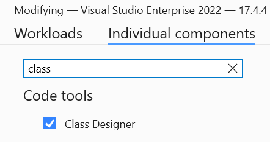

# 1. Házi feladatok - fejlesztőkörnyezet

## Bevezetés

A félév során a házi feladatok megoldásához a **Visual Studio 2022** fejlesztőkörnyezetet kell használni (a Visual Studio for Mac nem alkalmas). Ennek futtatásához Windows operációs rendszerre van szükség.  Ha telepítve van már a gépünkre a Visual Studio 2022, akkor a Start menüből indítsuk el a „Visual Studio Installer”-t. Ez induláskor ellenőrzi, érhető-e el Visual Studio-ból újabb változat online, és ha igen, az Update gombra kattintva indítsuk is el a legfrissebb verzió telepítését.

??? note  "Miért is van szükség Visual Studiora és Windowsra?"
    VS Code, illetve a Visual Studio for Mac a következők miatt nem használhatók:
    
    - Nem támogatják az UML (szerű) modellezést, melyre az első házi feladatnál szükség van.
    - Érdemben nem támogatják a *Windows Form* űrlap alapú .NET alkalmazások fejlesztését (erre a 3-5 házi feladat épít).

### Visual Studio edition-ök

A Visual Studionak több kiadása létezik:

- A tárgy teljesítéséhez megfelel a Microsoft honlapjáról letölthető és ingyenesen használható *Community* edition.
- Természetesen a *Professional* és *Enterprise* változatok is használhatók, a tárgy vonatkozásában ugyanakkor ezek érdemi pluszt nem adnak. Ezek az egyébként fizetős változatok az egyetem hallgatói számára ingyenesen elérhetők (a https://azureforeducation.microsoft.com/devtools honlapon, az Azure Dev Tools for Teaching program keretében).

### Telepítendő komponensek

A tárgy első előadása röviden kitér a .NET különböző változataira (.NET Framework, .NET Core, .NET 5-7 és  stb.). A feladatok megoldásához a .NET 7-et használjuk a félév során. A Visual Studio ezt telepíti, de szükség van a ".NET desktop development" Visual Studio Workload telepítésére:

1. Visual Studio telepítő indítása (pl. a Windows Start menüben a „Visual Studio Installer” begépelésével).
2. Modify gombra kattintás
3. A megjelenő ablakban ellenőrizzük, hogy a **".NET desktop development"** kártya ki van-e pipálva.
4. Ha nincs, pipáljuk ki, majd a jobb alsó sarokban a *Modify* gombra kattintva telepítsük.

Bizonyos házi feladatok esetén (már az elsőnél is) szükség van Visual Studio Class Diagram támogatásra. Ezt a következőképpen tudjuk utólag telepíteni a Visual Studio alá:

1. Visual Studio telepítő indítása (pl. a Windows Start menüben a „Visual Studio Installer” begépelésével).
2. Modify gombra kattintás
3. A megjelenő ablakban "Individual components" fül kiválasztása
4. A keresőmezőbe "class designer" begépelése, majd győződjünk meg, hogy a szűrt listában a "Class Designer" elem ki van pipálva.
5. Ha nincs, pipáljuk ki, majd a jobb alsó sarokban a *Modify* gombra kattintva telepítsük.

    

### MacBook és Linux használók számára információk

A tárgy felelős oktatójától (Benedek Zoltán) BME Cloud hozzáférés igénylelhető e-mailben.