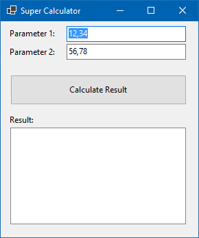
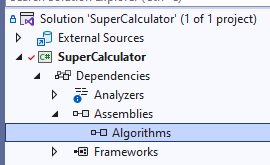

# 4. Többszálú alkalmazások készítése

## A gyakorlat célja

A gyakorlat célja, hogy megismertesse a hallgatókat a többszálas programozás során követendő alapelvekkel. Érintett témakörök (többek között):

- Szálak indítása (`Thread`)
- Szálak leállítása
- Szálbiztos (thread safe) osztályok készítése a `lock` kulcsszó alkalmazásával
- `ThreadPool` használata
- Jelzés és jelzésre várakozás szál szinkronizáció `ManualResetEvent` segítségével (`WaitHandle`)
- Windows Forms szálkezelési sajátosságok (`Invoke`)

Természetesen, mivel a témakör hatalmas, csak alapszintű tudást fogunk szerezni, de e tudás birtokában már képesek leszünk önállóan is elindulni a bonyolultabb feladatok megvalósításában.

A kapcsolódó előadások: Konkurens (többszálú) alkalmazások fejlesztése.

## Előfeltételek

A gyakorlat elvégzéséhez szükséges eszközök:

- Visual Studio 2022
- Windows 10 vagy Windows 11 operációs rendszer (Linux és macOS nem alkalmas)

## Bevezető

A párhuzamosan futó szálak kezelése kiemelt fontosságú terület, melyet miden szoftverfejlesztőnek legalább alapszinten ismernie kell. A gyakorlat során alapszintű, de kiemelt fontosságú problémákat oldunk meg, ezért törekednünk kell arra, hogy ne csak a végeredményt, hanem az elvégzett módosítások értelmét és indokait is megértsük.

A feladat során egyszerű Windows Forms alkalmazást fogunk felruházni többszálas képességekkel, egyre komplexebb feladatokat megoldva. Az alapprobléma a következő: van egy függvényünk, mely hosszú ideig fut, s mint látni fogjuk, ennek „direktben” történő hívása a felületről kellemetlen következményekkel jár. A megoldás során egy meglévő alkalmazást fogunk kiegészíteni saját kódrészletekkel. Az újonnan beszúrandó sorokat az útmutatóban kiemelt háttér jelzi.

## 0. Feladat - Ismerkedés a kiinduló alkalmazással, előkészítés

Klónozzuk le a 4. gyakorlathoz tartozó kiinduló alkalmazást repositoryját a [GitHub-ról](https://github.com/bmeviauab00/lab-tobbszalu-kiindulo), és nyissuk meg _SuperCalculator.sln_ solutiont Visual Studio-ban.

A feladatunk az, hogy egy bináris formában megkapott algoritmus futtatásához Windows Forms technológiával felhasználói felületet készítsünk. A bináris forma .NET esetében egy _.dll_ kiterjesztésű fájlt jelent, ami programozói szemmel egy osztálykönyvtár.  A fájl neve esetünkben _Algorithms.dll_, megtalálható a leklónozott repóban állományban.

A kiinduló alkalmazásban a felhasználói felület elő is van készítve. Futtassuk az alkalmazást:



Az alkalmazás felületén meg tudjuk adni az algoritmus bemenő paramétereit (double számok tömbje): a példánkban mindig két double szám paraméterrel hívjuk az algoritmust, ezt a két felső szövegmezőben lehet megadni.
A feladatunk az, hogy a _Calculate Result_ gombra kattintás során futtassuk az algoritmust a megadott paraméterekkel, majd, ha végzett, akkor a _Result_ alatti listázó mező új sorában jelenítsük meg a kapott eredményt a bemenő paraméterekkel együtt.

Következő lépésben ismerkedjünk meg a letöltött Visual Studio solutionnel:

1. Nézzük végig a `MainForm` osztályt.
   - Az látjuk, hogy a felület alapvetően kész, csak az algoritmus futtatása hiányzik. 
   - Az eredmény és a paraméterei naplózásához is találunk egy `ShowResult` nevű segédfüggvényt.
2. A `DataFifo` osztályt egyelőre hagyjuk ki, csak a gyakorlat második felében fogjuk használni, majd később megismerkedünk vele.

### A DLL-ben levő kód felhasználása

A kiinduló projektben megtaláljuk a _Algorithm.dll_-t. Ebben lefordított formában egy `Algorithms` névtérben levő `SuperAlgorithm` nevű osztály található, melynek egy `Calculate` nevű statikus művelete van. Ahhoz, hogy egy projektben fel tudjuk használni a DLL-ben levő osztályokat, a DLL-re a projektünkben egy ún. referenciát kell felvegyünk.

1. Solution Explorerben a projektünk _Dependencies_ node-jára jobbklikkelve válasszuk az _Add Project reference_ opciót!

    

    !!! note "Külső referenciák"

        Itt valójában nem egy másik Visual Studio projektre adunk referenciát, de így a legegyszerűbb előhozni ezt az ablakot.

        Megemlítendő még, hogy külső osztálykönyvtárak esetében már nem DLL-eket szoktunk referálni egy rendes projektben, hanem a .NET csomagkezelő rendeszeréből a NuGet-ről szokás a külső csomagokat beszerezni. Most az _Algorithm.dll_ esetünkben nincs NuGet-en publikálva, ezért kell kézzel felvegyük azt.

2. Az előugró ablak jobb alsó sarokban található _Browse_ gomb segítségével keressük meg és válasszuk ki projekt mappájában található _Algorithms.dll_ fájlt, majd hagyjuk jóvá a hozzáadást az OK gombbal!

A Solution Explorerben egy projekt alatti _Dependencies_ csomópontot lenyitva láthatjuk a hivatkozott külső függőségeket. Itt most már megjelenik az Assemblyk között előbb felvett Algorithms referencia is. A Frameworks kategóriában a .NET keretrendszer csomagjait találjuk. Az Analyzerek pedig statikus kódelemző eszközök fordítás időben. Illetve itt lennének még a projekt vagy a NuGet referenciák is.



Kattintsunk Algorithms referencián jobb gombbal és válasszuk a _View in Object Browser_ funkciót. Ekkor megnyílik az Object Browser tabfül, ahol megtekinthetjük, hogy az adott DLL-ben milyen névterek, osztályok találhatók, illetve ezeknek milyen tagjaik (tagváltozó, tagfüggvény, property, event) vannak. Ezeket a Visual Studio a DLL metaadataiból az ún. reflection mechanizmus segítségével olvassa ki (ilyen kódot akár mi is írhatunk).

Az alábbi ábrának megfelelően az Object Browserben baloldalt keressük ki az Algorithms csomópontot, nyissuk le, és láthatóvá válik, hogy egy `Algorithms` névtér van benne, abban pedig egy `SuperAlgorithm` osztály. Ezt kiválasztva középen megjelennek az osztály függvényei, itt egy függvényt kiválasztva pedig az adott függvény pontos szignatúrája:


## 1. Feladat – Művelet futtatása a főszálon

Most már rátérhetünk az algoritmus futtatására. Első lépésben ezt az alkalmazásunk fő szálán tesszük meg.

1. A főablakon lévő gomb `Click` eseménykezelőjében hívjuk meg a számoló függvényünket. Ehhez kattintsunk a Solution Explorerben duplán a `MainForm.cs` fájlra, majd a megjelenő Form Designer-ben a _Calculate Result_ gombra. Egészítsük ki a kódot az újonnan behivatkozott algoritmus meghívásával.

    ```cs hl_lines="7"
    private void buttonCalcResult_Click(object sender, EventArgs e)
    {
        if (double.TryParse(textBoxParam1.Text, out var p1) && double.TryParse(textBoxParam2.Text, out var p2))
        {
            var parameters = new double[] { p1, p2 };

            var result = Algorithms.SuperAlgorithm.Calculate(parameters);
            ShowResult(parameters, result);
        }
        else
        {
            MessageBox.Show(this, "Invalid parameter!", "Error");
        }
    }
    ```

2.	Próbáljuk ki az alkalmazást, és vegyük észre, hogy az ablak a számolás ideje alatt nem reagál a mozgatásra, átméretezésre, a felület gyakorlatilag befagy.

Az alkalmazásunk eseményvezérelt, mint minden Windows alkalmazás. Az operációs rendszer a különböző interakciókról (pl. mozgatás, átméretezés) üzenetekben értesíti az alkalmazásunkat. Mivel a gombnyomást követően az alkalmazásunk egyetlen szála a kalkulációval van elfoglalva, nem tudja azonnal feldolgozni a további felhasználói utasításokat. Amint a számítás lefutott (és az eredmények megjelennek a listában) a korábban kapott parancsok is végrehajtásra kerülnek.

## 2. Feladat – Végezzük a számítást külön szálban

Következő lépésben a számítás elvégzésére egy külön szálat fogunk indítani, hogy az ne blokkolja a felhasználói felületet.

1. Készítsünk egy új függvényt a `MainForm` osztályban, mely a feldolgozó szál belépési pontja lesz.

    ```cs
    private void CalculatorThread(object arg)
    {
        var parameters = (double[])arg;
        var result = Algorithms.SuperAlgorithm.Calculate(parameters);
        ShowResult(parameters, result);
    }
    ```

2. Indítsuk el a szálat a gomb `Click` eseménykezelőjében. Ehhez cseréljük le a korábban hozzáadott kódot:

    ```cs hl_lines="7-8"
    private void buttonCalcResult_Click(object sender, EventArgs e)
    {
        if (double.TryParse(textBoxParam1.Text, out var p1) && double.TryParse(textBoxParam2.Text, out var p2))
        {
            var parameters = new double[] { p1, p2 };

            var th = new Thread(CalculatorThread);
            th.Start(parameters);
        }
        else
        {
            MessageBox.Show(this, "Invalid parameter!", "Error");
        }
    }
    ```

    A Thread objektum `Start` műveletében átadott paramétert kapja meg a `CalculatorThread` szálfüggvényünk.

3.	Futtassuk az alkalmazást F5-tel! _InvalidOperationException, Cross-thread operation not valid_ hibaüzenetet kapunk a `ShowResult` metódusban, ugyanis nem abból a szálból próbálunk hozzáférni a UI elemhez / vezérlőhöz, amelyik létrehozta (a vezérlőt). A következő feladatban ezt a problémát oldjuk meg.

A problémát a következő okozza. Windows Forms alkalmazásoknál él az alábbi szabály: az űrlapok/vezérlőelemek alapvetően nem szálvédett objektumok, így egy űrlaphoz/vezérlőhöz csak abból a szálból szabad hozzáférni (pl. propertyjét olvasni, állítani, műveletét meghívni), amelyik szál az adott űrlapot/vezérlőt létrehozta, máskülönben kivételt kapunk.
Alkalmazásunkban azért kaptunk kivételt, mert a `listViewResult` vezérlőt a fő szálban hoztuk létre, a `ShowResult` metódusban az eredmény megjelenítésekor viszont egy másik szálból férünk hozzá (`listViewResult.Items.Add`).

A fenti szabály alól van pár kivétel, ilyen pl. a `Control` osztályban definiált `InvokeRequired` property és `Invoke` metódusa bármely szálból biztonságosan elérhető. Az `InvokeRequired` tulajdonság értéke igaz, ha nem a vezérlőelemet létrehozó szálból kérdezzük le az értékét, egyébként hamis. Az `Invoke` metódus pedig a vezérlőelemet létrehozó szálon futtatja le a paraméterként megadott metódust. Az `InvokeRequired` és a `Invoke` felhasználásával el tudjuk kerülni korábbi kivételünket, ezt fogjuk a következőkben megtenni.

## 3. Feladat – Tegyük szálbiztossá a ShowResult metódust (Invoke)

Módosítaniuk kell a `ShowResult` metódust, hogy mellékszálból történő hívás esetén se dobjon kivételt.

```cs hl_lines="3-8 12"
private void ShowResult(double[] parameters, double result)
{
    if (InvokeRequired)
    {
        Invoke(ShowResult, new object[] { parameters, result });
    }
    else if (!IsDisposed)
    {
        var lvi = listViewResult.Items.Add($"{parameters[0]} #  {parameters[1]} = {result}");
        listViewResult.EnsureVisible(lvi.Index);
        listViewResult.AutoResizeColumns(ColumnHeaderAutoResizeStyle.ColumnContent);
    }
}
```

Próbáljuk ki!

Ez a megoldás már működőképes. A `Form` osztály `InvokeRequired` metódusa igazat ad vissza, amennyiben nem az őt létrehozó szálból hívjuk meg. Ilyen esetekben a `Form`ot az `Invoke` metódusán keresztül tudjuk megkérni, hogy egy adott műveletet a saját szálán (amelyik a `Form`ot létrehozta, ez a legtöbb alkalmazásban a fő szál) hajtson végre. A fenti példában tulajdonképpen a `ShowResult` függvény önmagát hívja meg még egyszer, csak második esetben már a `Form` saját szálán. Ez egy bevett minta a redundáns kódok elkerülésére.

Tegyünk töréspontot a `ShowResult` művelet első sorára, és az alkalmazást futtatva győződjünk meg, hogy a `ShowResult` művelet – különösen az `Invoke` tekintetében – a fentiekben ismertetetteknek megfelelően működik.

Vegyük ki a töréspontot, így futtassuk az alkalmazást: vegyük észre, hogy amíg egy számítás fut, újabbakat is indíthatunk, hiszen a felületünk végig reszponzív maradt.
